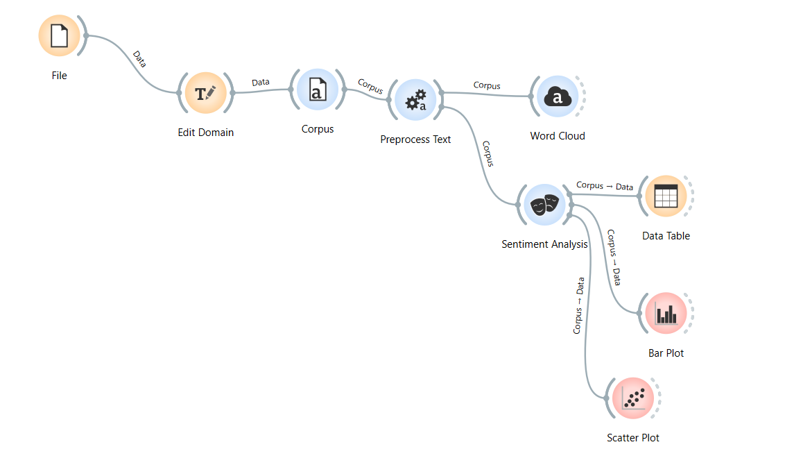

# **Análisis de Datos de Twitter con Orange Data Mining y Documentación de API**

## **Objetivo**
El objetivo de este proyecto fue extraer datos de Twitter mediante la API, analizarlos utilizando **Orange Data Mining**, y documentar la API utilizando **Swagger**. El análisis incluye limpieza de texto, generación de nubes de palabras, análisis de sentimientos y visualización de métricas.

---

## **Integrantes del Grupo 4**
- **Sebastián Aisalla**  
- **Tatiana Gualpa**  
- **Marcelo Maisincho**  
- **Stalin Yungan**  

---

## **1. Configuración y Extracción de Datos**
### **1.1 Configuración de la API de Twitter**
- Se creó una cuenta en el [Twitter Developer Portal](https://developer.twitter.com/).
- Se generaron las credenciales necesarias:
  - **API Key**, **API Secret Key**, **Access Token** y **Access Token Secret**.

---

### **1.2 Solicitudes en Postman**
Utilizamos **Postman** para realizar una solicitud GET al endpoint `/2/tweets/search/recent`.

#### **Parámetros Utilizados**
- `query`: Hashtag o consulta específica (ejemplo: `#tecnologia`).
- `max_results`: 100 (límite máximo).
- `tweet.fields`: `text`, `created_at`, `author_id`, `public_metrics`.

#### **Solicitud Ejemplo**
```http
GET https://api.twitter.com/2/tweets/search/recent?query=%23tecnologia&max_results=100&tweet.fields=created_at,author_id,public_metrics
Authorization: Bearer <TOKEN>
```

#### **Ejemplo de Respuesta JSON**
```json
{
  "data": [
    {
      "id": "1234567890123456789",
      "text": "Explorando el futuro de la tecnología con #IA y #BigData.",
      "created_at": "2024-12-11T03:09:58.000Z",
      "author_id": "1846404697231347712",
      "public_metrics": {
        "retweet_count": 25,
        "like_count": 50
      }
    }
  ]
}
```

---

## **2. Documentación de la API**
La documentación del endpoint fue creada en formato **OpenAPI** utilizando **Swagger**.

### **Archivo YAML**
El archivo completo se encuentra [aquí](./G4_1-API_Twitter-1.0.0-resolved.yaml).

---

## **3. Análisis de Datos en Orange Data Mining**
### **Flujo de Trabajo**
1. **Carga del Archivo CSV**  
   - Se utilizó el archivo: [`API_X_Tweets.csv`](./API_X_Tweets.csv).

2. **Limpieza del Texto**  
   - Se realizó con el widget **Preprocess Text**:  
     - Conversión a minúsculas.  
     - Tokenización usando expresiones regulares.  
     - Eliminación de palabras vacías (**Stopwords** en español).

3. **Generación de Nube de Palabras**  
   - Se usó el widget **Word Cloud** para visualizar los términos más frecuentes.  
     

   - **Hallazgos**:  
     - Las palabras más frecuentes fueron:  
       - **tecnología**: 78 menciones.  
       - **https**: 70 menciones.  
       - **rt**: 52 menciones.  
       - **mañana**, **recibimos**, **amor** y **educación** también fueron relevantes.

---

### **4. Análisis de Sentimiento**
- El widget **Sentiment Analysis** clasificó los tweets como **positivos**, **negativos** o **neutros**.  
- Se agregó una nueva columna **sentiment** con valores numéricos.  

   **Ejemplo de Tabla de Datos con Sentimiento**:  
   

   **Hallazgos**:
   - La mayoría de los tweets tienen sentimientos **positivos** con puntajes entre **5 y 18**.
   - Algunos tweets presentan valores negativos, aunque son minoría.

---

### **5. Visualización de Métricas**
#### **5.1 Gráfico de Barras (Bar Plot)**
- **Valores**: Sentimiento.  
- **Agrupado por**: `author_id`.  

   **Observación**:
   - Los autores con mayor número de tweets tienden a tener sentimientos positivos.  
   

#### **5.2 Gráfico de Dispersión (Scatter Plot)**
- **Eje X**: `like_count` (número de likes).  
- **Eje Y**: `retweet_count` (número de retweets).  
- **Color**: Sentimiento.  

   **Observación**:
   - Existe una **correlación directa** entre **likes** y **retweets**.  
   - La mayoría de los tweets con alto sentimiento positivo tienen valores bajos de likes y retweets, lo que sugiere contenido menos viral.  
   

---

## **4. Hallazgos Principales**
1. **Nube de Palabras**:  
   - La tecnología y temas relacionados con innovación son los más mencionados.  

2. **Análisis de Sentimientos**:  
   - Predominan los tweets con **sentimientos positivos**.  
   - Pocos tweets muestran sentimientos negativos.

3. **Retweets vs. Likes**:  
   - Existe correlación entre **retweets** y **likes**, aunque los valores son bajos.  

4. **Autores Destacados**:  
   - Algunos usuarios tienen una mayor cantidad de tweets relacionados al hashtag analizado.

---

## **5. Flujo Final**
A continuación, se presenta el flujo de trabajo final implementado en Orange Data Mining para el análisis de los tweets extraídos desde la API de Twitter. El flujo integra todas las etapas del procesamiento, análisis y visualización de datos: 
  

---
## **Archivos del Proyecto**
1. [Archivo CSV con los datos extraídos](./API_X_Tweets.csv).  
2. [Flujo de trabajo en Orange (.ows)](./workflow.ows).  
3. [Documentación YAML en Swagger](./G4_1-API_Twitter-1.0.0-resolved.yaml).  
4. Imágenes de análisis generadas en Orange:
   - Nube de Palabras  
   - Tabla de Sentimiento  
   - Gráfico de Barras  
   - Gráfico de Dispersión
   - Flujo de trabajo

---

## **Conclusión**
Este proyecto permitió combinar la extracción de datos desde la API de Twitter con análisis visuales y de texto en Orange. La documentación en **Swagger** asegura que el endpoint utilizado sea entendible y reusable por cualquier desarrollador.

---
