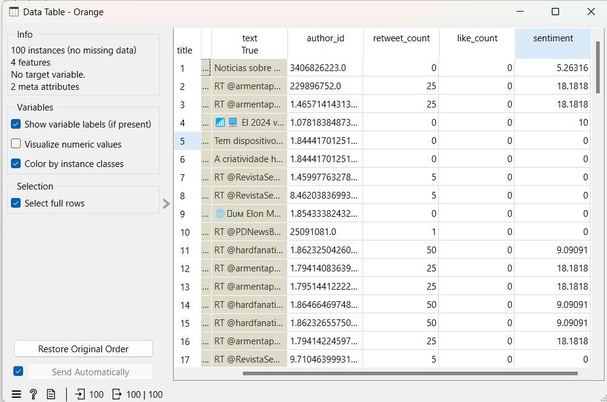

# **Análisis de Datos de Twitter con Orange Data Mining y Documentación de API**

## **Objetivo**
El objetivo de este proyecto fue extraer datos de Twitter mediante la API, analizarlos utilizando **Orange Data Mining**, y documentar la API utilizando **Swagger**. El análisis incluye limpieza de texto, generación de nubes de palabras, análisis de sentimientos y visualización de métricas.

---

## **Integrantes del Grupo 4**
- **Sebastián Aisalla**  
- **Tatiana Gualpa**  
- **Marcelo Maisincho**  
- **Stalin Yungan**  

---

## **1. Configuración y Extracción de Datos**
### **1.1 Configuración de la API de Twitter**
- Se creó una cuenta en el [Twitter Developer Portal](https://developer.twitter.com/).
- Se generaron las credenciales necesarias:
  - **API Key**, **API Secret Key**, **Access Token** y **Access Token Secret**.

---

### **1.2 Solicitudes en Postman**
Utilizamos **Postman** para realizar una solicitud GET al endpoint `/2/tweets/search/recent`.

#### **Parámetros Utilizados**
- `query`: Hashtag o consulta específica (ejemplo: `#tecnologia`).
- `max_results`: 100 (límite máximo).
- `tweet.fields`: `text`, `created_at`, `author_id`, `public_metrics`.

#### **Solicitud Ejemplo**
```http
GET https://api.twitter.com/2/tweets/search/recent?query=%23tecnologia&max_results=100&tweet.fields=created_at,author_id,public_metrics
Authorization: Bearer <TOKEN>
```

#### **Ejemplo de Respuesta JSON**
```json
{
  "data": [
    {
      "id": "1234567890123456789",
      "text": "Explorando el futuro de la tecnología con #IA y #BigData.",
      "created_at": "2024-12-11T03:09:58.000Z",
      "author_id": "1846404697231347712",
      "public_metrics": {
        "retweet_count": 25,
        "like_count": 50
      }
    }
  ]
}
```

---

## **2. Documentación de la API**
La documentación del endpoint fue creada en formato **OpenAPI** utilizando **Swagger**.

### **Archivo YAML**
El archivo completo se encuentra [aquí](./G4_1-API_Twitter-1.0.0-resolved.yaml).

---

## **3. Análisis de Datos en Orange Data Mining**
### **Flujo de Trabajo**
1. **Carga del Archivo CSV**  
   - Se utilizó el archivo: [`API_X_Tweets.csv`](./API_X_Tweets.csv).

2. **Limpieza del Texto**  
   - Se realizó con el widget **Preprocess Text**:  
     - Conversión a minúsculas.  
     - Tokenización usando expresiones regulares.  
     - Eliminación de palabras vacías (**Stopwords** en español).

3. **Generación de Nube de Palabras**  
   - Se usó el widget **Word Cloud** para visualizar los términos más frecuentes.  
     

   - **Hallazgos**:  
     - Las palabras más frecuentes fueron:  
       - **tecnología**: 78 menciones.  
       - **https**: 70 menciones.  
       - **rt**: 52 menciones.  
       - **mañana**, **recibimos**, **amor** y **educación** también fueron relevantes.

---

### **4. Análisis de Sentimiento**
- El widget **Sentiment Analysis** clasificó los tweets como **positivos**, **negativos** o **neutros**.  
- Se agregó una nueva columna **sentiment** con valores numéricos.  

   **Ejemplo de Tabla de Datos con Sentimiento**:  
   

   **Hallazgos**:
   - La mayoría de los tweets tienen sentimientos **positivos** con puntajes entre **5 y 18**.
   - Algunos tweets presentan valores negativos, aunque son minoría.

---

### **5. Visualización de Métricas**
#### **5.1 Gráfico de Barras (Bar Plot)**
- **Valores**: Sentimiento.  
- **Agrupado por**: `author_id`.  

   **Observación**:
   - Los autores con mayor número de tweets tienden a tener sentimientos positivos.  
   

#### **5.2 Gráfico de Dispersión (Scatter Plot)**
- **Eje X**: `like_count` (número de likes).  
- **Eje Y**: `retweet_count` (número de retweets).  
- **Color**: Sentimiento.  

   **Observación**:
   - Existe una **correlación directa** entre **likes** y **retweets**.  
   - La mayoría de los tweets con alto sentimiento positivo tienen valores bajos de likes y retweets, lo que sugiere contenido menos viral.  
   

---

## **4. Hallazgos Principales**
1. **Nube de Palabras**:  
   - La tecnología y temas relacionados con innovación son los más mencionados.  

2. **Análisis de Sentimientos**:  
   - Predominan los tweets con **sentimientos positivos**.  
   - Pocos tweets muestran sentimientos negativos.

3. **Retweets vs. Likes**:  
   - Existe correlación entre **retweets** y **likes**, aunque los valores son bajos.  

4. **Autores Destacados**:  
   - Algunos usuarios tienen una mayor cantidad de tweets relacionados al hashtag analizado.

---

## **Archivos del Proyecto**
1. [Archivo CSV con los datos extraídos](./API_X_Tweets.csv).  
2. [Flujo de trabajo en Orange (.ows)](./workflow.ows).  
3. [Documentación YAML en Swagger](./G4_1-API_Twitter-1.0.0-resolved.yaml).  
4. Imágenes de análisis generadas en Orange:
   - Nube de Palabras  
   - Tabla de Sentimiento  
   - Gráfico de Barras  
   - Gráfico de Dispersión  

---

## **Conclusión**
Este proyecto permitió combinar la extracción de datos desde la API de Twitter con análisis visuales y de texto en Orange. La documentación en **Swagger** asegura que el endpoint utilizado sea entendible y reusable por cualquier desarrollador.

---

¡Listo para entregar y subir en GitHub! 🚀
